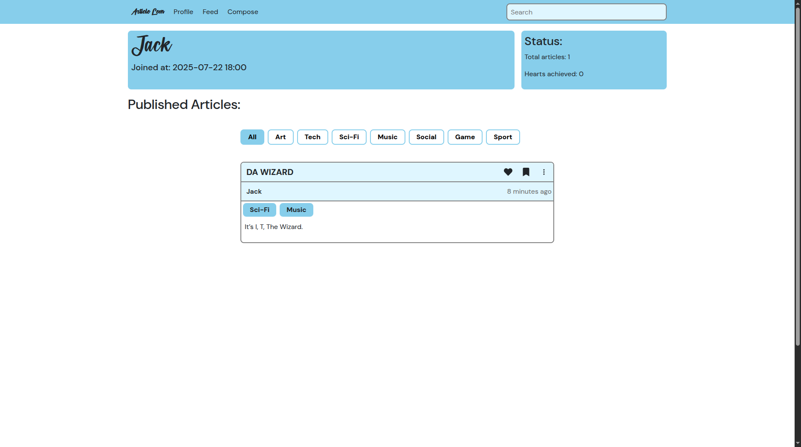

# A Short-form Article Platform

Welcome to this repo, Article-Leen is a platform for communicating with mini-articles, write and publish them so everyone can read, share, save and like them. Articles can be composed using a powerful text editor developed by [tiptap](https://tiptap.dev/) and in this project it contains all the useful extensions so there is many tools and features that you can make a beautiful bite-sized article!

**Tech Stack**: React, TypeScript, SCSS

To design the project as good as possible, StyleSheets, CSS modules and a little Bootstrap have been used. (and may tailwind in future)

### Features

- Create, edit, delete articles
- Bookmarking and liking system
- User authentication and JWT token support
- Authors personal profile
- Tag filtering (may be put on server-side in next versions)
- Responsive design

## Screenshots

### Feed Page

  

---

### Profile Pages

  

    
    
  

---

### Article Full View

  

## Installation

Before using this app, you need to run the server. To do this please follow installation guides in the [Article-Leen Server](https://github.com/PouryaFahimi/Article-Leen-Server#installation) page, so you can use the features.

After installing server, clone this repository and install dependencies:

    npm install

then run it:

    npm run dev

Enjoy!

## Upcoming Features

There is still some cool features that will added to the project in the future versions, so stay tuned!

- **Messaging** and chat section with authors
- **Customizable Theme**
- **Article images**, showing article
  images doesn't work correctly for now, because they are not received
  from the server.
- **Article Likes count**
- See the other users liked articles! currently you can only see your
  own likes.

### Contributing

Pull requests are welcome! For major changes, please open an issue first.

And, Thank you for supporting :)
